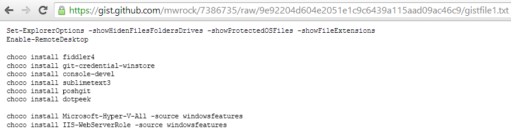
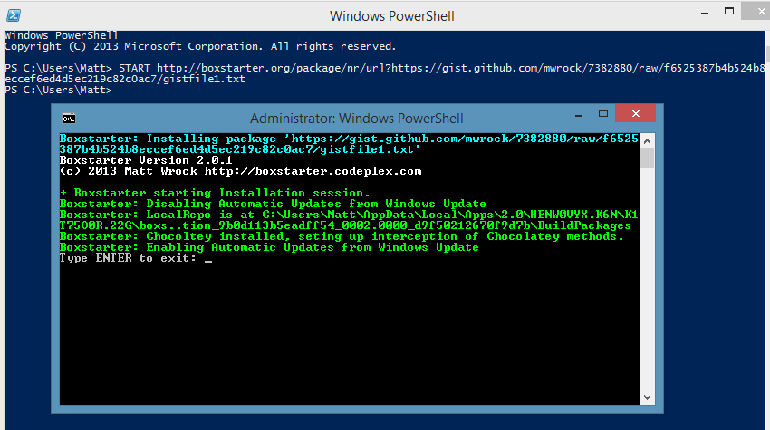
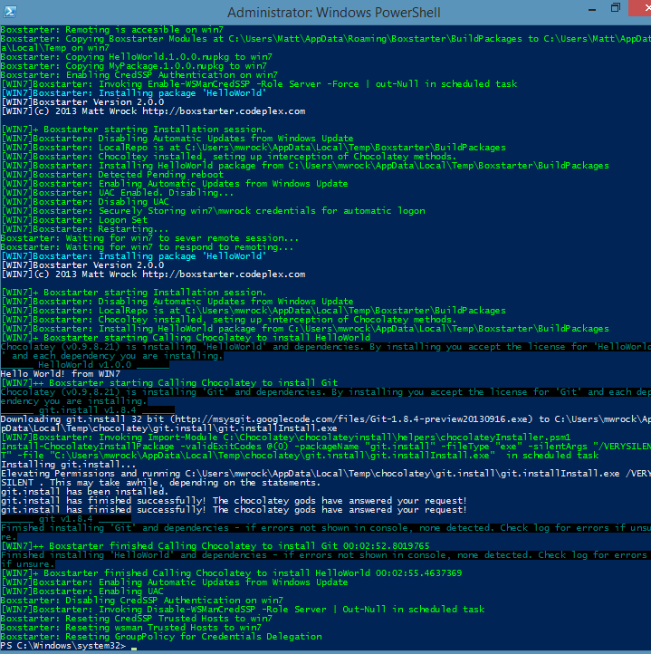

# Boxstarter

Repeatable, reboot resilient windows environment installations made easy using Chocolatey packages.

For more information and How Tos, visit [the official Boxstarter website](https://boxstarter.org).

The source of the Boxstarter website can be found in the [boxstarter.org repository](https://github.com/chocolatey/boxstarter.org).

## Windows Environment Creation Made Easy

* 100% Unattended Install with *pending reboot detection* and *automatic logon*.
* Remote machine deployments.
* Integrates with Hyper-V and Windows Azure VMs supporting checkpoint restore and creation.
* Installation packages build on top of [Chocolatey](https://chocolatey.org) package management.
* Easily install with just a [Gist and the Boxstarter Web Launcher](https://boxstarter.org/WebLauncher) or [create a private repository on a thumb drive or network share](https://boxstarter.org/InstallingPackages#InstallFromShare).
* See the [supported operating systems](https://docs.chocolatey.org/en-us/chocolatey-components-dependencies-and-support-lifecycle#supported-windows-versions) but may work on older.
* Lots of Windows configuration utilities including installing critical updates, changing Windows Explorer options, and more.

## Quickly install your favorite applications and settings, on any machine, with a gist! No pre-installed software needed

### Grab your Gist



### Launch the Boxstarter launcher



## Easily Package Installation Scripts and Resources In a NuGet Package

### A Simple Hello World

```powershell
Import-Module Boxstarter.Chocolatey
New-BoxstarterPackage HelloWorld
Set-Content (Join-Path $Boxstarter.LocalRepo "HelloWorld\Tools\ChocolateyInstall.ps1") `
  -Value "Write-Host `"Hello World! from `$env:COMPUTERNAME`";CINST Git" -Force
Invoke-BoxstarterBuild HelloWorld
```

### Install On Another Computer

```powershell
$creds = Get-Credential win\mwrock
Install-BoxstarterPackage -ComputerName win `
  -Package HelloWorld -Credential $creds
```



**NOTE:** PowerShell Remoting must be enabled on the remote machine. Launch a PowerShell Console as administrator:

```powershell
Enable-PSRemoting -Force
```

## Information

* [Boxstarter Website](https://boxstarter.org)
* [Mailing List](https://groups.google.com/forum/#!forum/boxstarter)
* [GitHub](https://github.com/chocolatey)
* [Twitter](https://twitter.com/chocolateynuget)
* [Facebook](https://www.facebook.com/ChocolateySoftware)
* [Blog](https://chocolatey.org/blog) / [Newsletter](https://us8.list-manage.com/subscribe?u=86a6d80146a0da7f2223712e4&id=73b018498d)
* [Documentation](https://boxstarter.org/whyboxstarter)
* [Community Chat](https://ch0.co/community)

### Documentation

Please see the [Boxstarter docs](https://boxstarter.org/whyboxstarter).

### Requirements

Boxstarter requires the following to work:

* Operating System: See the [Chocolatey supported Windows operating systems](https://docs.chocolatey.org/en-us/chocolatey-components-dependencies-and-support-lifecycle#supported-windows-versions).
* PowerShell Version 2 or higher.
* Administrative privileges on the machine where Boxstarter is running.

### License / Credits

Apache 2.0 - see [LICENSE](https://github.com/chocolatey/boxstarter/blob/master/LICENSE.txt) and [NOTICE](https://github.com/chocolatey/boxstarter/blob/master/NOTICE.txt) files.

## Etiquette Regarding Communication

If you are an open source user requesting support, please remember that most folks in the Chocolatey community are volunteers that have lives outside of open source and are not paid to ensure things work for you, so please be considerate of others' time when you are asking for things. Many of us have families that also need time as well and only have so much time to give on a daily basis. A little consideration and patience can go a long way. After all, you are using a pretty good tool without cost. It may not be perfect (yet), and we know that.

## Submitting Issues

* If you are having issues with a Chocolatey package, please see the [Chocolatey package triage process](https://docs.chocolatey.org/en-us/community-repository/users/package-triage-process#the-triage-process).
* If you are having issues with Chocolatey products please see [Troubleshooting](https://docs.chocolatey.org/en-us/troubleshooting) and the [FAQ](https://docs.chocolatey.org/en-us/faqs) to see if your question or issue already has an answer.

Observe the following help for submitting an issue.

### Prerequisites

* When creating an issue, please ensure you read the guidance at the top which includes links for Contributing and Submitting Issues documentation.
* The issue has to do with Boxstarter itself and is not a [Boxstarter website issue](https://github.com/chocolatey/boxstarter.org), Chocolatey package issue, a Chocolatey product issue.
* Please check to see if your issue already exists with a quick search of both open and closed issues. Start with one relevant term and then add if you get too many results.
* You are not submitting an "Enhancement". Enhancements should observe [CONTRIBUTING](https://github.com/chocolatey/boxstarter/blob/master/CONTRIBUTING.md) guidelines.
* You are not submitting a question - questions are better served as [emails](https://groups.google.com/forum/#!forum/boxstarter) or [Community Chat](https://ch0.co/community).
* Please make sure you've read over and agree with the [etiquette regarding communication](#etiquette-regarding-communication).

### Creating an Issue

* We'll need debug and verbose output, so please run and capture the log with `-Debug -Verbose` (ie. `Install-Boxstarter -PackageName <PACKAGE NAME OR GIST> -Verbose -Debug`. If it is less than 50 lines you can submit that with the issue or if it is longer, [create a gist](https://help.github.com/articles/creating-gists/) and link it.
* **Please note** that the debug/verbose output for some commands may have sensitive data (passwords or API Keys) related so please remove those if they are there prior to submitting the issue.
* If your issue needs output from `choco.exe`, then it logs to a file in `$env:ChocolateyInstall\log\`. You can grab the specific log output from there so you don't have to capture or redirect screen output. Please limit the amount included to just the command run (the log is appended to with every command).
* Please save the log output in a [gist](https://gist.github.com) (save the file as `log.sh`) and link to the gist from the issue. You can create it as secret so it doesn't fill up against your public gists but anyone with a direct link can still get to secret gists. If you accidentally include secret information in your gist, please delete it and create a new one (gist history can be seen by anyone) and update the link in the issue (issue history is not retained except by email - deleting the gist ensures that no one can get to it). Using gists this way also keeps accidental secrets from being shared in the issue in the first place as well.
* We'll need the entire log output from the run, so please don't limit it down to areas you feel are relevant. You may miss some important details we'll need to know. This will help expedite issue triage.
* It's helpful to include the version of Boxstarter, the version of the OS, whether running on physical or virtual hardware and the version of PowerShell - the debug script should capture all of those pieces of information.
* Include screenshots and / or animated gifs whenever possible as they help show us exactly what the problem is.

## Contributing

If you would like to contribute code or help squash a bug or two, that's awesome. Please familiarize yourself with [CONTRIBUTING](https://github.com/chocolatey/boxstarter/blob/master/CONTRIBUTING.md).

## Committers

Committers, you should be very familiar with [COMMITTERS](https://github.com/chocolatey/boxstarter/blob/master/COMMITTERS.md).
